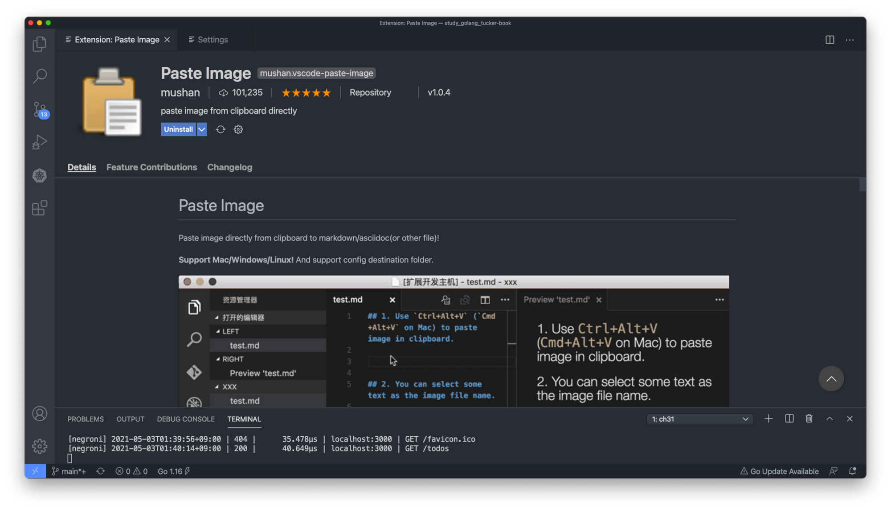
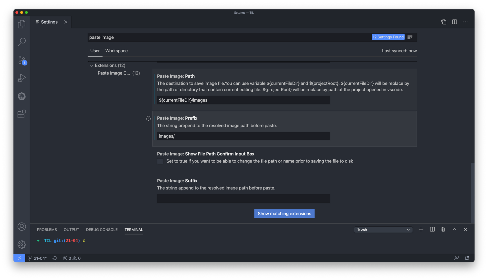
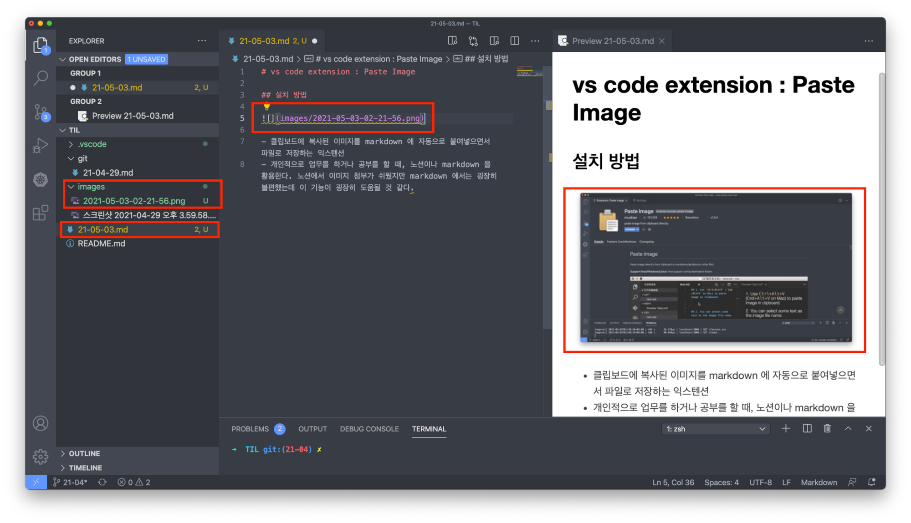

# vs code extension : Paste Image

## Paste Image 익스텐션이란?

- 클립보드에 복사된 이미지를 markdown 에 자동으로 붙여넣으면서 파일로 저장하는 익스텐션.
- 개인적으로 업무를 하거나 공부를 할 때, 노션이나 markdown 을 활용한다. 노션에서 이미지 첨부가 쉬웠지만 markdown 에서는 굉장히 불편했는데 이 기능이 굉장히 도움될 것 같다.

## 설치 방법

- vs code / extensions / paste image 검색 / install 버튼 클릭

## 기본 설정

- code / Preferences / Settings / User 혹은 Workspace / Extensions / Pate Image Configuration
- 여기서 다양한 설정을 할 수 있는데, 아래와 같이 이미지의 기본 저장 경로를 깔끔하게 변경했다.
    - `Paste Image: Path` 를 `${currentFileDir}` 에서 `${currentFileDir}/.uploads` 로 변경.
    - `Paste Image: Prefix` 에 `images/` 추가.

## 사용 예시

1. 클립보드에 이미지를 복사.
2. 마크다운 문서에 `opt + cmd + v` 로 붙여넣기
3. 복사된 이미지 경로와 이름 및 실제 복사된 이미지 확인
4. 좌측 디렉토리에 설정에 따라 `images` 폴더 밑에 정해진 명명규칙으로 이미지 파일이 복사된 것을 확인
5. 필요에 따라 마크다운에 이미지에 대한 이름 작성